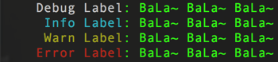

# spm-log

[![NPM version][npm-image]][npm-url]
[npm-image]: https://img.shields.io/npm/v/spm-log.svg?style=flat
[npm-url]: https://npmjs.org/package/spm-log

A console.log wrapper for spm or whatever.

## Installtion

```bash
$ npm i --save spm-log
```

## Usage

```js
var log = require('spm-log');

log.debug('Debug Label', 'BaLa~ BaLa~ BaLa~');
log.info('Info Label', 'BaLa~ BaLa~ BaLa~');
log.warn('Warn Label', 'BaLa~ BaLa~ BaLa~');
log.error('Error Label', 'BaLa~ BaLa~ BaLa~');
```


You can disable the colors globally:

```js
log.config({
  color: false
})
```
